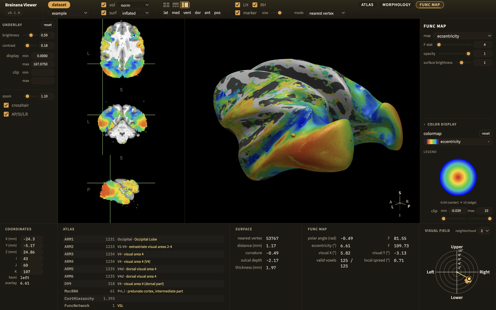

<p align="center">
  
</p>

# Brainana Viewer

**Brainana Viewer** is a free, cross-platform desktop app for exploring **macaque (monkey) brain MRI**.

View anatomical volumes, 3D cortical surfaces, atlases, and functional maps produced by the
[**Brainana**](https://github.com/xingyu-liu/brainana) preprocessing pipeline
([preprint](https://www.biorxiv.org/content/10.64898/2026.06.03.729972v1)).
Built on [NiiVue](https://github.com/niivue/niivue) + WebGL2, it runs on **macOS, Windows, and Linux**.

[](LICENSE)

## Features

<p align="center">
  
</p>

- **Volume & surface views** — volume slices and rotatable 3D surface.
- **Surface morphometry** — curvature, depth, or thickness on cortex.
- **Atlases & regions** — automatically overlay brain parcellations and read the region under your cursor.
- **Functional maps** — retinotopy and somatotopy on both volume and surface.
- **Local or remote data** — dataset on your computer or a lab workstation.
- **Compare monkeys** — easily switch subjects to compare across monkeys.

## Download & install

Grab the app for your operating system from the **[Releases page](../../releases/latest)**.

| Your system | Download |
| ----------- | -------- |
| **macOS — Apple Silicon** (M1/M2/M3…) | `Brainana Viewer-*-arm64.dmg` |
| **macOS — Intel** | `Brainana Viewer-*.dmg` |
| **Windows** | `Brainana Viewer Setup *.exe` |
| **Linux** | `Brainana Viewer-*.AppImage` or `brainana-viewer_*_amd64.deb` |

> **First launch:** the app is currently **unsigned**, so the first time you open it macOS and
> Windows warn that it's from an unidentified developer. You only need to clear this once per app.
>
> - **macOS:** double-click the app; when it's blocked, open **System Settings → Privacy &
>   Security**, scroll down to the **Security** section, and click **Open Anyway** (confirm with
>   your password). *(On macOS Sequoia and later, the old right-click → Open shortcut no longer
>   works — use this route.)*
> - **Windows:** on the SmartScreen prompt choose **More info → Run anyway**.
> - **Linux:** no prompt.

Not sure which Mac chip you have? Check **Apple menu → About This Mac.**

No account or sign-up is required. The app opens to a welcome screen with nothing loaded yet —
add a dataset to begin (see [Quick start](#quick-start)).

## Quick start

When you open the app it starts on a welcome screen — no data is loaded yet. Add a dataset to begin:

1. **Add a dataset.** Click **dataset** (top-left) and point the Viewer at a **brainana output
   directory** — a folder containing `sub-*` subjects. This can be a **local** folder or a
   **remote** workstation over **SSH/SFTP**. Add more than one if you like.
2. **Choose a monkey.** Pick a subject from the **monkey** dropdown; the default anatomy + surface view loads.
3. **Explore.** Use the toolbar and side panel to switch the base volume and surface, add an
   **atlas**, apply **morphology** shading or a **func map**, and tune colormaps. Click anywhere
   to move the crosshair and read out values.
4. **Compare.** Reopen the **monkey** dropdown to switch subjects — your view settings carry over.

### Try the demo dataset

No dataset of your own yet? A small [demo subject](datasets/demo_viewer) (`sub-example`) lives in
this repo. Grab just the `demo_viewer` folder and add it as a local dataset to try the app. This
needs git ≥ 2.25:

```sh
git clone --depth 1 --filter=blob:none --sparse https://github.com/arcaro-lab/brainana_tools.git
cd brainana_tools
git sparse-checkout set datasets/demo_viewer     # a real brainana output dir
```

Then, in the app, open the **dataset** panel and, under **local dataset**, add the `demo_viewer`
folder:

```
brainana_tools/
└─ datasets/
   └─ demo_viewer/   ← add THIS folder
      ├─ sub-example/
      └─ fastsurfer/
```

> [!IMPORTANT]
> Add the **`demo_viewer` folder itself** — the level that *contains* `sub-example/`, not one of
> the subject folders inside it.

On older git, clone the whole repo instead: `git clone https://github.com/arcaro-lab/brainana_tools.git`.

---

## Architecture

An **npm-workspaces monorepo**: tool-agnostic shared `packages/*` consumed by per-tool `apps/*`.
Adding a sibling tool (Aligner, Editor) means a new `apps/<tool>/`, with no duplicated platform
code.

| Package             | Responsibility                                                        |
| ------------------- | --------------------------------------------------------------------- |
| `core-server`       | HTTP runtime, security, DataSource registry (local + SFTP), cache, export |
| `core-launcher`     | `bootServer()` (token → free port → server) + `launch()` (opens browser)   |
| `core-desktop`      | Electron shell: `runDesktop()` loads the loopback URL natively        |
| `core-client`       | Browser platform: runtime/source/filesystem clients, session, WebGL2 gate |
| `ui` / `niivue-kit` | Design-token theme + DOM helpers / generic NiiVue helpers             |
| `imaging-math`      | Pure headless math (ROI warp, volume→surface projection)              |
| `apps/viewer`       | The Viewer: SPA + manifest/FreeSurfer server + launch/desktop entries |

Cross-package imports use `@brainana/*` specifiers whose `exports` map points at **raw source**.
That way Vite and Node's `.ts` tests resolve identically, with no build step in the test path.

## Citing Brainana

If you use the Brainana Viewer or the Brainana pipeline in your research, please cite the
Brainana preprint and link the software:

- **Paper:** [preprint](https://www.biorxiv.org/content/10.64898/2026.06.03.729972v1)
- **Preprocessing pipeline:** [](https://github.com/xingyu-liu/brainana)
- **Viewer:** this repository.

## Acknowledgements & references

The Viewer is built on the shoulders of excellent open-source work. The key pieces:

**Core rendering & data**
- [**NiiVue**](https://github.com/niivue/niivue) — the WebGL2 neuroimaging engine that draws every slice and surface.
- [**fflate**](https://github.com/101arrowz/fflate) — fast zlib/gzip for compressed NIfTI/GIFTI payloads.
- [**nifti-reader-js**](https://github.com/rii-mango/NIFTI-Reader-JS) — NIfTI-1/2 header & data parsing.
- [**ssh2**](https://github.com/mscdex/ssh2) — pure-JS SSH/SFTP client backing the remote data source.

**Build, packaging & language**
- [**TypeScript**](https://www.typescriptlang.org/)
- [**Vite**](https://vitejs.dev/)
- [**Electron**](https://www.electronjs.org/)
- [**electron-builder**](https://www.electron.build/)
- [**Node.js**](https://nodejs.org/) (≥ 22.18)

**Standards**
- [WebGL 2.0](https://www.khronos.org/webgl/).

## License

Licensed under the **GNU Affero General Public License v3.0** (AGPL-3.0), the same license
as the parent [**Brainana**](https://github.com/xingyu-liu/brainana) pipeline. See [LICENSE](LICENSE).